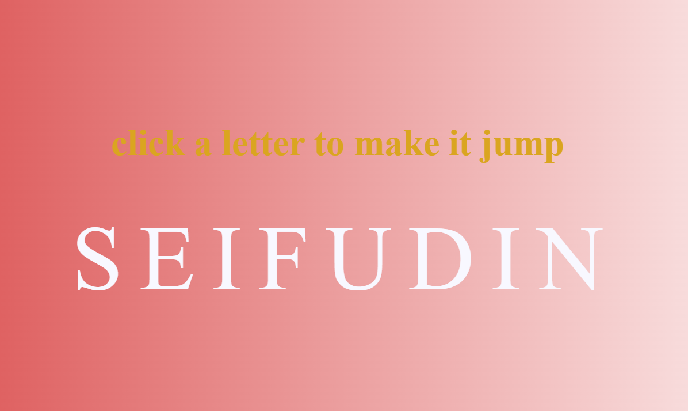

# 🔤 Jumping Letters Animation Website

A small interactive web project that displays **animated jumping letters** using **HTML, CSS, and JavaScript**. The letters bounce smoothly on the screen to create a playful and engaging visual effect.

This project was created as a practice exercise to explore **CSS animations and basic JavaScript interactions** while building a fun UI animation.

---

## 🚀 Project Overview

The website displays text where each letter performs a **jumping/bouncing animation** on clicking on it. The animation is handled primarily with **CSS keyframes**, while **JavaScript adds dynamic behavior and control** over the letters.

The goal of the project was to experiment with:

* CSS keyframe animations
* Text manipulation with JavaScript
* Interactive front-end design
* Smooth UI effects

---

## 🛠️ Technologies Used

* **HTML5** – Provides the structure of the webpage
* **CSS3** – Handles styling and jumping animations using keyframes
* **JavaScript** – Controls the animation behavior and dynamic letter effects

---

## 📂 Project Structure

```
jumping-letters/
│
├── screenshot.png
├── index.html
├── style.css
├── script.js
└── README.md
```

---

## ⚙️ How It Works

1. The text is written in the HTML structure.
2. JavaScript separates the text into individual **letters**.
3. Each letter is wrapped in its own element.
4. CSS **keyframe animations** make the letters jump or bounce.
5. The animation runs continuously, creating a dynamic visual effect.

---

## ▶️ How to Run the Project

1. Clone the repository:

```
git clone https://github.com/Seifudinsec/jumping-letters-miniproject.git
```

2. Open the project folder.

3. Open **index.html** in your browser.

No installation or dependencies are required.

---

## 🎨 Features

* Smooth jumping/bouncing letter animation
* Lightweight and fast
* Pure front-end project
* Easy to customize text and animation speed

---

## 📸 Screenshot

Add a screenshot of the project here:

```

```

---

## 💡 Possible Improvements

Future updates could include:

* Different animation styles (wave, bounce, rotate)
* Interactive hover effects
* Adjustable animation speed
* Color-changing letters
* Responsive typography

---

## 🎯 Learning Goals

This project helped reinforce understanding of:

* CSS animation with `@keyframes`
* JavaScript DOM manipulation
* Creating engaging UI animations
* Structuring small front-end projects

---

## 📄 License

This project is open-source and free to use for learning and experimentation.

---

⭐ If you like the project, feel free to **star the repository**!
